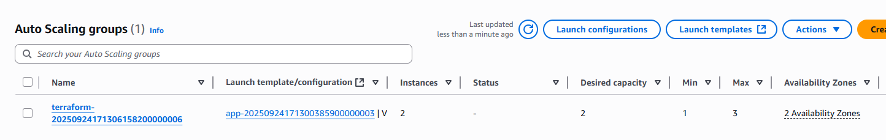

# Terraform Multi-Tier AWS Infrastructure

## Overview
This project deploys a fully automated multi-tier web application infrastructure on AWS using Terraform. 
### It includes:
- A VPC with public and private subnets across multiple Availability Zones
- An Application Load Balancer (ALB) in public subnets
- Auto Scaling EC2 instances behind the ALB
- A secure RDS database in private subnets
- Security groups and route tables for proper network isolation

## Project Structure
```
terraform-multi-tier/
├── modules/
│   ├── vpc/
│   ├── alb/
│   ├── ec2_asg/
│   ├── rds/
│   └── security/
├── main.tf
├── variables.tf
├── terraform.tfvars
└── README.md
```

## Prerequisites
### Software Requirements
- Terraform v1.5+
- AWS CLI configured (aws configure)

### AWS Requirements
- AWS account
- Valid AMI ID in your region

## Setup 
1. Copy the example vars file:
   cp terraform.tfvars.example terraform.tfvars
2. Edit `terraform.tfvars` with your own values.

## Usage 
1. Clone the repo
     ```bash
     git clone 
     cd terraform-multi-tier
2. Initialize Terraform
    ```bash
    terraform init
3. Validate configuration
    ```bash
    terraform validate
4. Plan deployment
    ```bash
    terraform plan
5. Apply changes
    ```bash
    terraform apply 

## Apply changes
### Example terraform.tfvars
```hcl
project_name   = "multi-tier"
vpc_cidr       = "10.0.1.0/16"
public_subnets = ["10.0.1.0/24"]
azs            = ["eu-west-2"]
ami_id         = "ami-123456"
db_password    = "SuperSecretPass123"
```

## Outputs 
- ALB DNS Name 
- RDS Endpoint
- ASG details

## AWS Console Showing the Deployed Resources

### Terraform Apply


### 1. Network Layer
- **VPC**  
  
- **Subnets**  
  
- **Route Tables**  
  

### 2. Web Tier
- **EC2 Instances**  
  
- **Auto Scaling Group (ASG)**  
  
- **Application Load Balancer (ALB)**  
  

### 3. Application / Database Tier
- **RDS Instance**  
  
- **Security Groups**  
  

## Architecture
         Internet
            |
           ALB
         /     \
     EC2-ASG   EC2-ASG
         \     /
          RDS (private)

## Outputs
Outputs provided by Terraform after apply:
- ALB DNS Name → access your app
- RDS Endpoint → database connection
- Auto Scaling Group details → instance IDs and count

## Tips
- Ensure the AMI ID exists in your AWS region
- Update terraform.tfvars to match your desired subnets and AZs
- Destroy resources after testing to avoid charges

## Cleanup
Steps to destroy the infrastructure
```bash
terraform destroy 

